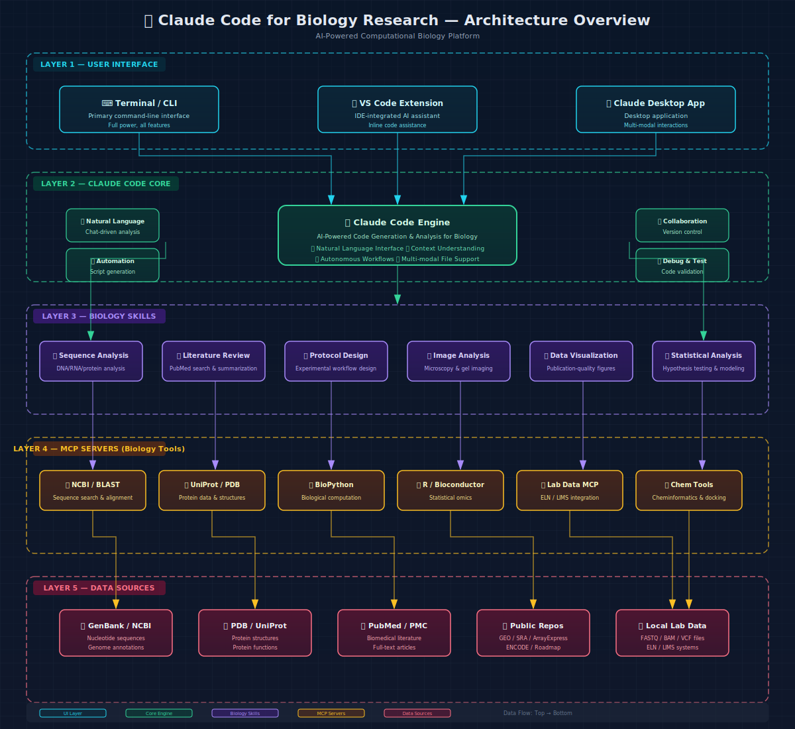
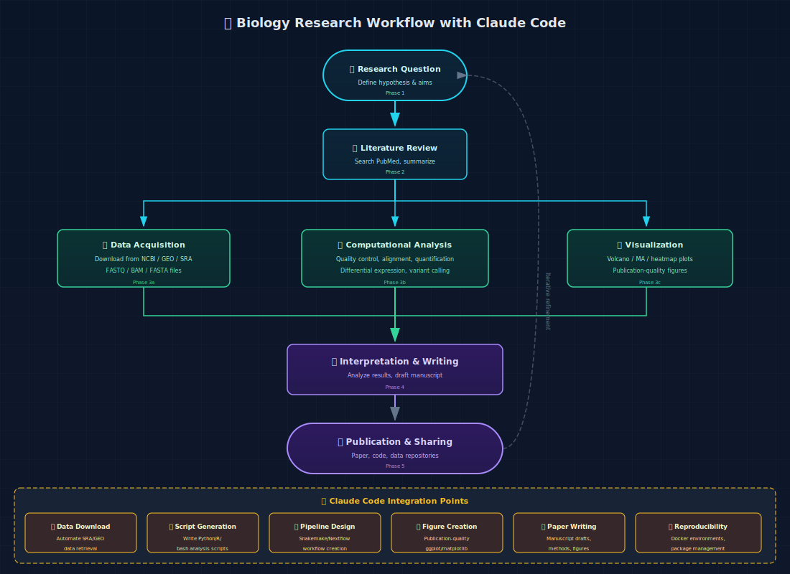
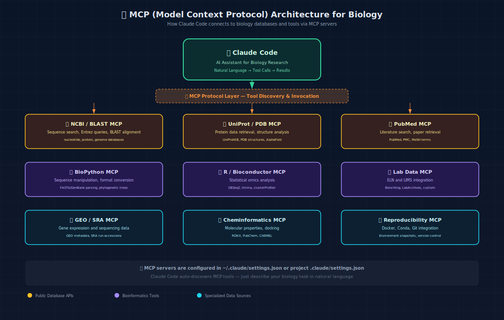

<div align="center">
  <br/>
  
  <br/>
  <h1>🧬 Claude Code 生物学研究指南</h1>
  <p>
    <strong>一份关于如何使用 Claude Code 作为 AI 驱动助手进行计算生物学、生物信息学和生物医学研究的全面指南</strong>
  </p>
  <p>
    <a href="#-安装指南"></a>
    <a href="#-快速上手"></a>
    <a href="#-生物学技能"></a>
    <a href="#-mcp服务器"></a>
    <a href="#-生物学工作流"></a>
  </p>
  <p>
    <a href="README.md"></a>
    <a href="https://claude.ai/code"></a>
    <a href="https://modelcontextprotocol.io"></a>
    <a href="https://github.com/Jeny-Liu/claude-code-biology-research"></a>
  </p>
  <br/>
</div>

---

## 📋 目录

- [🌐 项目概述](#-项目概述)
- [✨ 核心特性](#-核心特性)
- [📦 安装指南](#-安装指南)
  - [系统要求](#系统要求)
  - [安装 Claude Code](#安装-claude-code)
  - [身份认证](#身份认证)
  - [代理配置](#代理配置)
  - [验证安装](#验证安装)
- [🚀 快速上手](#-快速上手)
  - [第一次生物学会话](#第一次生物学会话)
  - [核心 CLI 命令](#核心-cli-命令)
- [🧠 生物学技能](#-生物学技能)
  - [内置技能](#内置技能)
  - [自定义生物学技能](#自定义生物学技能)
  - [技能开发指南](#技能开发指南)
- [🔌 MCP 服务器](#-mcp服务器)
  - [什么是 MCP？](#什么是-mcp)
  - [核心生物学 MCP 服务器](#核心生物学-mcp-服务器)
  - [MCP 配置指南](#mcp-配置指南)
  - [自定义 MCP 服务器开发](#自定义-mcp-服务器开发)
- [🧪 生物学工作流](#-生物学工作流)
  - [基因组学与转录组学](#基因组学与转录组学)
  - [蛋白质组学与结构生物学](#蛋白质组学与结构生物学)
  - [文献综述与元分析](#文献综述与元分析)
  - [生物图像分析](#生物图像分析)
  - [实验方案设计](#实验方案设计)
- [📝 实战示例](#-实战示例)
  - [示例 1：RNA-seq 数据分析](#示例-1rna-seq-数据分析)
  - [示例 2：蛋白质结构检索](#示例-2蛋白质结构检索)
  - [示例 3：文献综述自动化](#示例-3文献综述自动化)
- [⚙️ 高级配置](#️-高级配置)
  - [Settings.json 详解](#settingsjson-详解)
  - [自定义钩子](#自定义钩子)
  - [环境管理](#环境管理)
- [🤝 最佳实践](#-最佳实践)
- [📚 资源与参考](#-资源与参考)
- [📄 许可证](#-许可证)

---

## 🌐 项目概述

**Claude Code** 是 Anthropic 官方推出的命令行界面（CLI）AI 编程助手，专为 Claude 模型设计。对于生物学研究人员和计算生物学家来说，Claude Code 代表了一种范式转变——它弥合了生物学领域知识与计算实现之间的鸿沟。

过去，生物学数据分析需要你掌握多种编程语言、熟悉各种数据库接口、维护复杂的分析流程。如今，有了 Claude Code，你可以：

1. **用自然语言描述你的生物学研究任务**
2. **让 Claude Code 理解上下文并自动生成相应代码**
3. **交互式地执行、调试和完善分析流程**
4. **自动化重复性的生物信息学工作**
5. **无缝集成公共生物数据库和实验室数据系统**



### 工作原理

Claude Code 在你的终端中作为一个**智能代理系统**运行：

```
你: "从 GEO 数据库 (GSE12345) 下载 RNA-seq 数据，进行差异表达分析，并绘制火山图"

Claude Code:
  ✓ 将你的请求分解为可执行步骤
  ✓ 使用 MCP 工具查询 GEO 数据库
  ✓ 下载 FASTQ/计数数据
  ✓ 编写 Python/R 脚本进行 DESeq2 分析
  ✓ 执行分析
  ✓ 生成可发表质量的图表
  ✓ 总结结果
```

本指南涵盖从安装到高级工作流编排的所有内容，专为生物学研究定制。

---

## ✨ 核心特性

| 特性 | 生物学研究应用 |
|---------|---------------------------|
| **🧬 自然语言到代码** | 描述生物学概念；Claude 自动编写 Python/R/Bash 脚本 |
| **🔗 MCP 工具集成** | 直接访问 NCBI、UniProt、PDB、PubMed 等数据库 |
| **📊 多模态支持** | 分析显微图像、凝胶照片和科研图表 |
| **🔄 自主工作流** | 端到端分析管线，支持迭代优化 |
| **📝 学术写作** | 起草稿件、方法部分和文献综述 |
| **📦 可重复性科学** | 生成 Conda/Docker 环境，管理包依赖 |
| **🗂️ 项目管理** | 在结构化项目中组织代码、数据和结果 |
| **🤝 协作** | 原生 Git 支持，适合团队协作和代码共享 |

---

## 📦 安装指南

### 系统要求

| 要求 | 最低配置 | 推荐配置 |
|------------|---------|-------------|
| **操作系统** | macOS 10.15+, Ubuntu 20.04+, Windows 10+ (推荐 WSL2) | 最新稳定版 |
| **Node.js** | 18.x | 20.x LTS |
| **npm** | 8.x | 10.x+ |
| **Python** | 3.8 | 3.11+ (用于生物信息学) |
| **R** | 4.0 | 4.3+ (用于 Bioconductor) |
| **磁盘空间** | 1 GB | 10 GB+ (用于生物数据库) |
| **内存** | 4 GB | 16 GB+ |
| **网络** | 安装和 API 访问需要 | 宽带 |

### 安装 Claude Code

#### 方法 1：npm（推荐）

```bash
# 全局安装
npm install -g @anthropic-ai/claude-code

# 或使用 npx 一次性使用
npx @anthropic-ai/claude-code
```

#### 方法 2：VS Code 扩展

从 [VS Code 市场](https://marketplace.visualstudio.com/items?itemName=anthropic.claude-code) 安装 Claude Code 扩展，或：

```bash
# 通过 VS Code CLI 安装
code --install-extension anthropic.claude-code
```

#### 方法 3：Homebrew（macOS/Linux）

```bash
brew install anthropic/claude-code/claude-code
```

#### 方法 4：中国大陆用户加速安装

```bash
# 设置 npm 镜像源加速（中国大陆推荐）
npm config set registry https://registry.npmmirror.com

# 安装
npm install -g @anthropic-ai/claude-code

# 如需恢复官方源
npm config set registry https://registry.npmjs.org
```

### 身份认证

Claude Code 需要 Anthropic API 密钥：

```bash
# 设置 API 密钥
export ANTHROPIC_API_KEY="sk-ant-xxxxxxxxxxxx"

# 或保存到 ~/.claude/.env 文件以持久化
echo 'ANTHROPIC_API_KEY="sk-ant-xxxxxxxxxxxx"' >> ~/.claude/.env
```

> 💡 **对于生物学研究人员：** 如果你的机构拥有企业级 Anthropic 账户，请通过机构 IT 部门申请 API 密钥。注意数据隐私和安全，不要共享你的 API 密钥。

#### 获取 API 密钥

1. 访问 [console.anthropic.com](https://console.anthropic.com)
2. 创建账户或登录
3. 导航到 **API Keys**
4. 创建新密钥
5. 复制密钥并安全存储

### 代理配置

如果在需要使用代理的网络环境中（常见于中国高校和研究机构）：

```bash
# HTTP/HTTPS 代理
export HTTP_PROXY="http://127.0.0.1:7897"
export HTTPS_PROXY="http://127.0.0.1:7897"

# 配置 Git 代理（用于克隆仓库）
git config --global http.proxy http://127.0.0.1:7897
git config --global https.proxy http://127.0.0.1:7897

# 配置 npm 代理
npm config set proxy http://127.0.0.1:7897
npm config set https-proxy http://127.0.0.1:7897
```

### 验证安装

```bash
# 检查版本
claude --version

# 启动交互式会话
claude

# 运行快速测试
claude -p "编写一个 Python 脚本，计算 DNA 序列的反向互补: ATGCGTAC"
```

**预期输出：**
```python
def reverse_complement(seq):
    """返回 DNA 序列的反向互补序列。"""
    complement = {'A': 'T', 'T': 'A', 'C': 'G', 'G': 'C'}
    return ''.join(complement.get(base, base) for base in reversed(seq))

seq = "ATGCGTAC"
result = reverse_complement(seq)
print(f"原序列: {seq}")
print(f"反向互补: {result}")
# 输出: 原序列: ATGCGTAC
#        反向互补: GTACGCAT
```

---

## 🚀 快速上手

### 第一次生物学会话

```bash
# 启动 Claude Code
claude
```

进入交互式会话后，尝试以下生物学研究提示：

```
1️⃣ "使用 curl 下载人类基因组 hg38 FASTA 文件并用 samtools 建立索引"

2️⃣ "用 BioPython 编写一个 Python 脚本，解析 GenBank 文件并提取 CDS 特征。
     保存为 parse_genbank.py"

3️⃣ "搜索 PubMed 上关于 CRISPR 先导编辑的最新论文，总结前 5 篇"

4️⃣ "用 R 中的 ggplot2 根据这个差异表达 CSV 文件创建火山图"
```

### 核心 CLI 命令

| 命令 | 用途 | 生物学研究应用 |
|---------|---------|---------------------|
| `claude` | 启动交互式会话 | 开始一个分析会话 |
| `claude -p "提示"` | 运行一次性命令 | 快速序列操作 |
| `claude --model "claude-sonnet-4-20250514"` | 指定模型 | 复杂分析使用最新模型 |
| `claude -e "python script.py"` | 编辑已有文件 | 完善分析脚本 |
| `claude -i "文件路径"` | 包含系统提示 | 加载机构协议 |
| `/clear` | 清空会话 | 重置以进行新分析 |
| `/help` | 显示帮助 | 浏览可用命令 |
| `/init` | 初始化项目配置 | 设置项目专属设置 |
| `/fast` | 切换快速模式 | 简单任务的快速响应 |
| `/loop` | 定时重复命令 | 监控长时间运行的分析 |

> 💡 **专业提示：** 在 Shell 脚本中使用 `claude -p "提示"` 来构建自动化的生物信息学管线！

---

## 🧠 生物学技能

Claude Code 的 **技能（Skills）** 是专门化的能力模块——可以将其视为为 Claude 提供特定领域专家级能力的插件。技能可以通过 CLI 中的 `/技能名称` 加载或以编程方式调用。

### 内置技能

以下是生物学研究中最有价值的内置技能：

#### 📚 文献与写作技能

| 技能 | 调用方式 | 描述 | 生物学应用 |
|-------|-----------|-------------|-----------------|
| **systematic-literature-review** | `/systematic-literature-review` | 多源文献搜索、质量评分和结构化综述自动生成 | 系统综述、元分析、相关工作章节 |
| **academic-writing-polisher** | `/academic-writing-polisher` | 领域感知的学术写作润色 | 稿件精修、基金申请书 |
| **paper-write-sci** | `/paper-write-sci` | 根据数据和提纲生成科学论文草稿 | 完整稿件撰写 |
| **paper-select-journal** | `/paper-select-journal` | 根据稿件内容推荐目标期刊 | 期刊选择指导 |
| **review-papers** | `/review-papers` | 同行评审模拟，带结构化反馈 | 投稿前自我审查 |
| **paper-explain-figures** | `/paper-explain-figures` | 解读科学图表并生成可访问性描述 | 图注说明 |

#### 🔬 生物信息学与实验室技能

| 技能 | 调用方式 | 描述 |
|-------|-----------|-------------|
| **chem-vis** | `/chem-vis` | 从 SMILES/名称生成 2D/3D 分子可视化 |
| **thesis-review** | `/thesis-review` | 综合论文结构和内容审查 |
| **systematic-literature-review** | `/systematic-literature-review` | AI 驱动的文献调研，带质量评分 |

#### 🛠️ 开发与工作流技能

| 技能 | 调用方式 | 描述 |
|-------|-----------|-------------|
| **code-review** | `/code-review` | 审查生物信息学代码的正确性和效率 |
| **simplify** | `/simplify` | 优化和重构分析脚本 |
| **verify** | `/verify` | 验证代码修改是否按预期工作 |
| **deep-research** | `/deep-research` | 多源深度研究，带事实核查和引用 |
| **init** | `/init` | 项目脚手架搭建 |
| **run** | `/run` | 启动项目应用并与之交互 |

### 自定义生物学技能

你可以为特定生物学研究需求创建自定义技能：

```bash
# 创建新技能
claude -p "创建一个用于单细胞 RNA-seq 分析工作流自动化的自定义技能"
```

自定义技能结构示例——**单细胞 RNA-seq 分析技能**：

<details>
<summary>📁 <strong>自定义技能示例：scRNA-seq 分析</strong>（点击展开）</summary>

```markdown
# 技能: scrna-seq-analysis

## 描述
使用 ScanPy 和 Seurat 进行自动化单细胞 RNA-seq 分析流程

## 触发词
- "分析单细胞数据"
- "scRNA-seq 工作流"
- "单细胞聚类"

## 步骤
1. 质量控制：基于基因计数和线粒体含量过滤细胞
2. 归一化：Log 归一化并识别高度可变基因
3. 降维：PCA、UMAP、t-SNE
4. 聚类：使用分辨率优化的 Leiden 聚类
5. 标记基因识别：每个簇的差异表达
6. 细胞类型注释：使用参考数据库自动注释
7. 可视化：UMAP 图、热图、点图

## 依赖
- scanpy>=1.9
- anndata>=0.9
- leidenalg
- matplotlib>=3.6
- pandas>=1.5
```
</details>

### 技能开发指南

创建生物学专业技能的步骤：

```bash
# 步骤 1：使用技能创建器
# 在 Claude Code 中：
/skill-creator

# 步骤 2：描述你的生物学工作流
# "创建一个用于 ChIP-seq 峰值检测和基序分析的技能"

# 步骤 3：技能将被注册，可通过 /你的技能名称 调用
```

**生物学技能设计原则：**

| 原则 | 描述 | 示例 |
|-----------|-------------|---------|
| **领域特定** | 专注于一种生物学分析类型 | "ChIP-seq 分析"而非"测序分析" |
| **可重复** | 包含版本锁定的依赖 | `scanpy==1.9.3` |
| **文档化** | 清晰的输入/输出规范 | 输入：FASTQ 文件，输出：peak BED 文件 |
| **模块化** | 可与其他技能组合 | QC 技能 → 比对技能 → Peak calling 技能 |

---

## 🔌 MCP 服务器

### 什么是 MCP？

**MCP（Model Context Protocol，模型上下文协议）** 是一种开放标准，允许 Claude Code 直接连接外部工具、数据库和服务。可以将 MCP 服务器视为**"适配器"**，为 Claude 提供对生物学数据源和计算工具的实时访问。



**MCP 工作原理：**

```
┌─────────────┐    MCP 协议    ┌──────────────┐    HTTP/API    ┌──────────────┐
│  Claude Code │ ◄──────────────► │  MCP 服务器  │ ◄────────────► │  NCBI / UniProt / PDB / PubMed  │
│  (AI 引擎)   │                 │  (适配器)    │               │  (数据库)     │
└─────────────┘                 └──────────────┘               └──────────────┘
```

### 核心生物学 MCP 服务器

#### 1️⃣ **NCBI/BLAST MCP 服务器**

访问美国国家生物技术信息中心（NCBI）数据库和 BLAST 搜索：

```json
{
  "mcpServers": {
    "ncbi-biology": {
      "command": "uvx",
      "args": ["ncbi-mcp-server"],
      "env": {
        "NCBI_API_KEY": "你的_ncbi_api_key",
        "EMAIL": "你的邮箱@机构.edu"
      }
    }
  }
}
```

**功能：**
- `search_nucleotide(查询)` — 搜索核苷酸数据库
- `search_protein(查询)` — 搜索蛋白质数据库
- `run_blast(序列, 数据库)` — BLAST 序列搜索
- `fetch_genbank(登录号)` — 下载 GenBank 记录
- `fetch_fasta(登录号)` — 下载 FASTA 序列
- `search_pubmed(查询)` — PubMed 文献搜索
- `search_geo(查询)` — GEO 数据集搜索

> 🔑 **NCBI API 密钥：** 在 [ncbi.nlm.nih.gov](https://www.ncbi.nlm.nih.gov/account/) 注册可获得更高的速率限制。无密钥时限制为 3 次请求/秒；有密钥时可达 10 次请求/秒。

#### 2️⃣ **UniProt/PDB MCP 服务器**

访问蛋白质序列、结构和功能数据：

```json
{
  "mcpServers": {
    "uniprot-pdb": {
      "command": "uvx",
      "args": ["uniprot-mcp-server"]
    }
  }
}
```

**功能：**
- `search_uniprot(查询)` — 搜索 UniProtKB
- `get_protein(登录号)` — 检索蛋白质条目
- `fetch_pdb(pdb_id)` — 下载 PDB 结构文件
- `search_pdb(查询)` — 搜索 PDB 结构
- `get_alphafold(uniprot_id)` — 检索 AlphaFold 预测
- `get_protein_features(登录号)` — 结构域、位点和功能注释
- `search_by_sequence(序列)` — 序列相似性搜索

#### 3️⃣ **PubMed MCP 服务器**

高级文献挖掘和检索：

```json
{
  "mcpServers": {
    "pubmed-mcp": {
      "command": "npx",
      "args": ["-y", "pubmed-mcp-server"],
      "env": {
        "NCBI_API_KEY": "你的_ncbi_api_key"
      }
    }
  }
}
```

**功能：**
- `search_pubmed(查询, 最大结果数)` — 使用 MeSH 术语搜索
- `fetch_article(pmid)` — 获取文章完整元数据
- `fetch_pmc(pmcid)` — 获取 PMC 全文
- `get_citations(pmid)` — 引文分析
- `find_related(pmid)` — 查找相似文章
- `search_with_filters(作者, 期刊, 年份)` — 高级过滤

#### 4️⃣ **BioPython MCP 服务器**

执行 BioPython 序列操作：

```json
{
  "mcpServers": {
    "biopython-mcp": {
      "command": "uvx",
      "args": ["biopython-mcp-server"]
    }
  }
}
```

**功能：**
- `parse_sequence(文件, 格式)` — 解析 FASTA/GenBank/FASTQ
- `translate_dna(序列)` — DNA 到蛋白质翻译
- `reverse_complement(序列)` — 反向互补
- `align_sequences(*序列)` — 多序列比对
- `calculate_gc_content(序列)` — GC 含量计算
- `phylogenetic_tree(比对)` — 系统发育树构建
- `blast_sequence(序列)` — 本地或远程 BLAST

#### 5️⃣ **R/Bioconductor MCP 服务器**

组学数据的统计分析：

```json
{
  "mcpServers": {
    "r-bioconductor": {
      "command": "uvx",
      "args": ["r-bioc-mcp-server"],
      "env": {
        "R_HOME": "/path/to/R"
      }
    }
  }
}
```

**功能：**
- `run_deseq2(计数矩阵, 实验设计, 模型公式)` — 差异表达分析
- `run_limma(表达矩阵, 设计矩阵)` — 微阵列/RNA-seq 分析
- `run_enrichment(基因列表, 本体)` — GO/KEGG 富集分析
- `run_clustering(数据, 方法)` — 层次聚类
- `plot_volcano(结果, p值, 差异倍数)` — 火山图生成
- `plot_heatmap(数据, 注释)` — 热图可视化
- `run_pca(数据, 分组)` — 主成分分析

#### 6️⃣ **GEO/SRA MCP 服务器**

基因表达综合数据库（GEO）和序列读段档案（SRA）访问：

```json
{
  "mcpServers": {
    "geo-sra": {
      "command": "uvx",
      "args": ["geo-mcp-server"],
      "env": {
        "NCBI_API_KEY": "你的_ncbi_api_key"
      }
    }
  }
}
```

**功能：**
- `search_geo(查询)` — 查找 GEO 数据集
- `fetch_geo_series(gse_id)` — 获取系列元数据
- `fetch_geo_platform(gpl_id)` — 平台信息
- `get_sra_runs(登录号)` — SRA 运行 accession
- `download_metadata(gse_id)` — 样本元数据表
- `search_datasets(关键词, 物种)` — 带过滤的数据集搜索

#### 7️⃣ **化学信息学 MCP 服务器**

分子分析和药物发现：

```json
{
  "mcpServers": {
    "cheminfo": {
      "command": "uvx",
      "args": ["cheminformatics-mcp-server"]
    }
  }
}
```

**功能：**
- `smiles_to_structure(smiles)` — 生成分子结构
- `calculate_properties(smiles)` — LogP、分子量、氢键供体/受体数
- `search_pubchem(查询)` — PubChem 化合物搜索
- `search_chembl(靶点)` — ChEMBL 生物活性数据
- `dock_molecule(受体, 配体)` — 分子对接
- `fingerprint_similarity(smiles1, smiles2)` — Tanimoto 相似度

### MCP 配置指南

#### 全局配置（应用于所有项目）

```bash
# 编辑全局设置文件
nano ~/.claude/settings.json
```

```json
{
  "mcpServers": {
    "ncbi-biology": {
      "command": "uvx",
      "args": ["ncbi-mcp-server"],
      "env": {
        "NCBI_API_KEY": "${NCBI_API_KEY}",
        "EMAIL": "${EMAIL}"
      }
    },
    "pubmed-mcp": {
      "command": "npx",
      "args": ["-y", "pubmed-mcp-server"],
      "env": {
        "NCBI_API_KEY": "${NCBI_API_KEY}"
      }
    },
    "biopython-mcp": {
      "command": "uvx",
      "args": ["biopython-mcp-server"]
    },
    "uniprot-pdb": {
      "command": "uvx",
      "args": ["uniprot-mcp-server"]
    }
  }
}
```

#### 项目专属配置

```bash
# 在你的生物学项目目录中
cd /path/to/your/biology-project

# 创建项目设置
mkdir -p .claude
nano .claude/settings.json
```

```json
{
  "mcpServers": {
    "r-bioconductor": {
      "command": "uvx",
      "args": ["r-bioc-mcp-server"]
    },
    "geo-sra": {
      "command": "uvx",
      "args": ["geo-mcp-server"],
      "env": {
        "NCBI_API_KEY": "${NCBI_API_KEY}"
      }
    },
    "custom-lab-mcp": {
      "command": "python",
      "args": ["path/to/your/custom-mcp-server.py"]
    }
  }
}
```

#### 安装 MCP 服务器

大多数 MCP 服务器在首次使用时自动安装。手动安装方法：

```bash
# 使用 uvx（推荐用于基于 Python 的 MCP 服务器）
pip install uvx  # 如果尚未安装
uvx ncbi-mcp-server

# 使用 npx（用于基于 Node.js 的服务器）
npx -y pubmed-mcp-server

# 使用 pip
pip install ncbi-mcp-server

# 使用 conda（生物学环境常用）
conda install -c bioconda ncbi-mcp-server
```

> 💡 **uvx** 是运行基于 Python 的 MCP 服务器的推荐方式——它自动创建隔离环境。

### 自定义 MCP 服务器开发

你可以构建自定义 MCP 服务器，将 Claude Code 与实验室的特定工具和数据库连接。

#### Python MCP 服务器模板

**文件：`my-biology-mcp-server.py`**

```python
#!/usr/bin/env python3
"""
生物学研究自定义 MCP 服务器
将 Claude Code 连接到实验室特定的数据库和工具
"""

import json
import sys
from typing import Any

class BiologyMCPTool:
    """MCP 工具基类"""
    
    def __init__(self, name: str, description: str, parameters: dict):
        self.name = name
        self.description = description
        self.parameters = parameters
    
    def execute(self, **kwargs) -> str:
        raise NotImplementedError

class SequenceAnalysis(BiologyMCPTool):
    """序列分析工具"""
    
    def __init__(self):
        super().__init__(
            name="analyze_sequence",
            description="分析 DNA/RNA/蛋白质序列",
            parameters={
                "type": "object",
                "properties": {
                    "sequence": {
                        "type": "string",
                        "description": "待分析的生物序列"
                    },
                    "seq_type": {
                        "type": "string",
                        "enum": ["dna", "rna", "protein"],
                        "description": "序列类型"
                    }
                },
                "required": ["sequence", "seq_type"]
            }
        )
    
    def execute(self, sequence: str, seq_type: str = "dna") -> str:
        """执行序列分析"""
        seq = sequence.upper()
        length = len(seq)
        
        result = {
            "length": length,
            "gc_content": None
        }
        
        if seq_type in ("dna", "rna"):
            gc = (seq.count("G") + seq.count("C")) / length * 100
            result["gc_content"] = round(gc, 2)
            result["reverse_complement"] = self._revcomp(seq)
        
        return json.dumps(result, indent=2, ensure_ascii=False)
    
    def _revcomp(self, seq: str) -> str:
        comp = {"A": "T", "T": "A", "C": "G", "G": "C", 
                "U": "A", "N": "N"}
        return "".join(comp.get(b, "N") for b in reversed(seq))


# MCP 服务器主循环
def main():
    server = {"analyze_sequence": SequenceAnalysis()}
    
    print("Biology MCP Server 已初始化", file=sys.stderr)
    
    while True:
        try:
            line = sys.stdin.readline()
            if not line:
                break
            
            message = json.loads(line)
            
            if message["type"] == "list_tools":
                response = {
                    "type": "tool_list",
                    "tools": [
                        {
                            "name": t.name,
                            "description": t.description,
                            "inputSchema": t.parameters
                        }
                        for t in server.values()
                    ]
                }
            elif message["type"] == "call_tool":
                tool = server.get(message["name"])
                if tool:
                    result = tool.execute(**message.get("arguments", {}))
                    response = {"type": "tool_result", "result": result}
                else:
                    response = {"type": "error", "error": f"未知工具: {message['name']}"}
            
            print(json.dumps(response), flush=True)
            
        except json.JSONDecodeError:
            continue
        except Exception as e:
            print(json.dumps({"type": "error", "error": str(e)}), flush=True)

if __name__ == "__main__":
    main()
```

**注册自定义 MCP 服务器：**

```json
{
  "mcpServers": {
    "my-biology-lab": {
      "command": "python",
      "args": ["/path/to/my-biology-mcp-server.py"]
    }
  }
}
```

---

## 🧪 生物学工作流

### 基因组学与转录组学

#### RNA-seq 差异表达分析

```
在 Claude Code 中：
"从 GEO 数据库 GSE123456 下载 RNA-seq 计数数据。
使用 DESeq2 进行差异表达分析。
实验设计包含 3 个对照组和 3 个处理组样本。
生成火山图、前 20 个差异表达基因的热图和 GO 富集分析。"
```

<details>
<summary><strong>🔍 预期工作流步骤</strong>（点击展开）</summary>

1. **数据检索**：通过 MCP 服务器查询 GEO → 下载计数矩阵
2. **数据预处理**：过滤低表达基因，归一化
3. **统计分析**：DESeq2 差异表达（|log2FC| > 1, padj < 0.05）
4. **可视化**：
   - 火山图（ggplot2）
   - 前 20 个 DEGs 热图（pheatmap）
   - PCA 图
5. **功能富集**：GO 和 KEGG 通路分析（clusterProfiler）
6. **生成报告**：汇总统计和图

</details>

#### 变异检测流程

```
"使用 GATK 最佳实践创建完整的变异检测流程。
处理这个 BAM 文件：aligned_sample.bam。
包括碱基质量重校准、变异检测和 VCF 过滤。"
```

#### 单细胞 RNA-seq 分析

```
"分析这份 10X Genomics scRNA-seq 数据。
进行 QC 过滤、归一化、聚类和细胞类型注释。
使用 Seurat（R）或 ScanPy（Python）。"
```

### 蛋白质组学与结构生物学

#### 蛋白质结构检索和分析

```
"从 PDB 和 UniProt 获取人类 TP53 蛋白（P04637）的结构。
可视化 DNA 结合结构域，并识别所有与癌症相关的错义突变。"
```

<details>
<summary><strong>🔍 预期工作流步骤</strong>（点击展开）</summary>

1. **检索数据**：通过 MCP 服务器获取 UniProt P04637 条目
2. **获取结构**：TP53 的最佳 PDB 结构
3. **结构域分析**：识别功能结构域（转录激活域、DNA 结合域、四聚化域）
4. **突变映射**：与 COSMIC/ClinVar 交叉参考，找出癌症相关突变
5. **结构可视化**：生成 PyMOL/3D 可视化脚本

</details>

#### 分子对接工作流

```
"将化合物 CID_123456 与 SARS-CoV-2 主蛋白酶（PDB: 6LU7）进行分子对接。
使用 AutoDock Vina 并可视化结合构象。"
```

### 文献综述与元分析

#### 系统文献综述

```bash
# 激活系统综述技能
/systematic-literature-review

# 该技能将引导你完成：
# 1. 使用 PICO 框架定义研究问题
# 2. 多数据库搜索（PubMed、PMC、bioRxiv）
# 3. 自动论文筛选和质量评分
# 4. 数据提取和综合
# 5. 生成带 PRISMA 流程图的结构化综述
```

#### 自动论文摘要

```
"搜索 PubMed 上 2024-2025 年关于'spatial transcriptomics'的论文。
用 3 句话总结每篇论文。
创建一个比较方法、研究组织和主要发现的表格。"
```

#### 引文网络分析

```
"查找所有引用 2016 年 'Comprehensive genomic characterization 
of head and neck squamous cell carcinomas' 论文（PMID: 26940866）的文章。
按癌症类型分类并分析引文趋势。"
```

### 生物图像分析

#### 显微镜图像处理

```
"分析 'images/' 目录中的这些免疫荧光图像。
量化 DAPI 和 GFP 信号的共定位。
生成荧光强度直方图。"
```

#### Western Blot 定量分析

```
"定量分析这张 western blot 图像中的蛋白条带。
归一化到内参（GAPDH）。
计算每个处理条件的相对表达量。"
```

### 实验方案设计

#### 方案生成

```
"设计一个在 HEK293T 细胞中敲除 TP53 基因的 CRISPR-Cas9 方案。
包括 gRNA 设计、质粒构建、转染和 Sanger 测序验证。
提供引物序列。"
```

#### 方案优化

```
"优化这个 qPCR 方案以提高扩增效率。
当前方案：[粘贴方案]
如有必要，建议退火温度梯度和引物重新设计。"
```

---

## 📝 实战示例

### 示例 1：RNA-seq 数据分析

**目标**：从 GEO 数据到可发表图表的完整 RNA-seq 分析。

**Claude Code 提示：**

```
我有一份来自 GEO (GSE123456) 的 RNA-seq 数据集，
研究药物处理对乳腺癌细胞的影响。
有 3 个对照组和 3 个处理组样本。

请：
1. 从 GEO 下载计数数据
2. 使用 DESeq2 进行差异表达分析
3. 创建火山图（log2FC vs -log10 p-value）
4. 生成前 30 个差异表达基因的热图
5. 对上调基因进行 GO 富集分析
6. 将所有结果和图表保存到 'results/' 目录
```

**Claude Code 将执行的操作：**

```bash
# 步骤 1：设置项目结构
mkdir -p results figures data

# 步骤 2：通过 MCP 下载数据
# Claude 查询 GEO MCP 服务器
# 下载计数矩阵和元数据

# 步骤 3：编写并执行 R 脚本
Rscript deseq2_analysis.R

# 步骤 4：生成图表
# 火山图 → figures/volcano.pdf
# 热图 → figures/heatmap.pdf
# PCA → figures/pca.pdf

# 步骤 5：运行富集分析
Rscript enrichment.R
# → results/go_enrichment.csv

# 步骤 6：总结结果
cat results/summary.md
```

### 示例 2：蛋白质结构检索

**目标**：检索并分析蛋白质结构信息。

**Claude Code 提示：**

```
使用 UniProt MCP 服务器，获取人类表皮生长因子受体
（EGFR，P00533）的信息。

然后：
1. 获取结构域架构
2. 查找覆盖不同结构域的已知 PDB 结构
3. 检索最高分辨率的结构
4. 识别癌症中酪氨酸激酶结构域的所有突变（来自 COSMIC）
5. 生成显示蛋白质结构域和突变热点的示意图
6. 创建人和小鼠 EGFR 的序列比对
```

### 示例 3：文献综述自动化

**目标**：自动化针对特定主题的文献综述。

**Claude Code 提示：**

```
对以下主题进行系统文献综述：
"机器学习方法在罕见疾病药物重定位中的应用"

使用 systematic-literature-review 技能：
1. 搜索 PubMed、bioRxiv 和 CrossRef 的相关论文
2. 筛选标题/摘要的相关性（评分 1-10）
3. 提取：年份、期刊、ML 方法、疾病重点、数据来源、性能指标
4. 创建筛选过程的 PRISMA 流程图
5. 生成结构化综述，包含：
   - 使用的 ML 技术总结（图神经网络、transformer 等）
   - 数据来源比较（DrugBank、ChEMBL、ClinicalTrials.gov）
   - 主要发现和验证方法
   - 未来方向和局限性
6. 输出为带参考文献的格式化 markdown 文档
```

---

## ⚙️ 高级配置

### Settings.json 详解

`settings.json` 文件控制 Claude Code 的行为。位置：

| 范围 | 文件路径 |
|-------|-----------|
| **全局** | `~/.claude/settings.json` |
| **项目** | `.claude/settings.json`（在项目根目录） |

**生物学研究者的完整 `settings.json`：**

```json
{
  "mcpServers": {
    "ncbi-biology": {
      "command": "uvx",
      "args": ["ncbi-mcp-server"],
      "env": {
        "NCBI_API_KEY": "${NCBI_API_KEY}",
        "EMAIL": "${EMAIL}"
      }
    },
    "pubmed-mcp": {
      "command": "npx",
      "args": ["-y", "pubmed-mcp-server"],
      "env": {
        "NCBI_API_KEY": "${NCBI_API_KEY}"
      }
    },
    "uniprot-pdb": {
      "command": "uvx",
      "args": ["uniprot-mcp-server"]
    },
    "biopython-mcp": {
      "command": "uvx",
      "args": ["biopython-mcp-server"]
    },
    "r-bioconductor": {
      "command": "uvx",
      "args": ["r-bioc-mcp-server"]
    },
    "geo-sra": {
      "command": "uvx",
      "args": ["geo-mcp-server"],
      "env": {
        "NCBI_API_KEY": "${NCBI_API_KEY}"
      }
    },
    "cheminfo": {
      "command": "uvx",
      "args": ["cheminformatics-mcp-server"]
    }
  },
  "permissions": {
    "allow": [
      "bash",
      "read",
      "write",
      "edit",
      "glob",
      "grep"
    ]
  }
}
```

### 自定义钩子

钩子（Hooks）允许你在 Claude Code 操作前后自动执行动作：

**文件: `.claude/hooks/before-command.sh`**
```bash
#!/bin/bash
# 每次分析前激活 conda 环境
source ~/miniconda3/etc/profile.d/conda.sh
conda activate biology-env
```

**文件: `.claude/hooks/after-command.sh`**
```bash
#!/bin/bash
# 将所有命令记录到带时间戳的文件
echo "[$(date)] $CLAUDE_COMMAND" >> ~/.claude/history.log
```

### 环境管理

#### 生物学研究的 Conda 环境

```bash
# 创建综合生物学环境
conda create -n biology-env python=3.11 -y
conda activate biology-env

# 核心生物信息学工具
conda install -c bioconda -y samtools bedtools bcftools fastqc \
  trimmomatic bwa star hisat2 subread

# Python 包
pip install biopython pandas numpy matplotlib seaborn scanpy \
  anndata pytables jupyter scikit-learn scipy

# R 和 Bioconductor
conda install -c conda-forge -y r-base r-essentials
conda install -c bioconda -y r-deseq2 r-limma r-clusterprofiler \
  r-ggplot2 r-pheatmap r-complexheatmap

# MCP 服务器
pip install uvx
```

#### Docker 环境

```dockerfile
FROM continuumio/miniconda3:latest

# 创建生物学环境
RUN conda create -n biology python=3.11 && \
    conda run -n biology pip install biopython pandas matplotlib

# 安装 Claude Code
RUN npm install -g @anthropic-ai/claude-code

# 设置默认命令
CMD ["claude"]
```

---

## 🤝 最佳实践

### 生物学研究建议

| 实践 | 建议 | 原因 |
|----------|---------------|-----|
| **🔬 数据管理** | 使用结构化项目目录（`data/`、`scripts/`、`results/`、`figures/`） | 可重复性和组织性 |
| **🧪 版本控制** | 用 Git 追踪所有分析脚本和配置文件 | 追踪变更、协作 |
| **📊 可重复性** | 固定软件版本（Conda/Docker） | 确保结果可被复现 |
| **📝 文档化** | 记录每个分析会话 | 相当于实验记录本 |
| **🔐 数据隐私** | 切勿将敏感患者数据上传到公共 AI 服务 | 符合 HIPAA/GDPR 法规 |
| **🎯 提示工程** | 明确说明工具、参数和预期输出 | 更好结果，更少迭代 |
| **✅ 验证** | 在实际数据上运行前始终验证 AI 生成的代码 | 科学严谨性 |
| **🔄 迭代工作流** | 从小处开始，验证中间结果，再扩大规模 | 错误预防 |

### 提示工程技巧

**好的提示：**
```
"使用 Biopython，解析文件 'sequences.gb' 并提取所有 CDS 特征。
将每个 CDS 翻译为蛋白质并保存到 'proteins.faa'。
报告找到了多少个 CDS 特征和最长的蛋白质长度。"
```

**不好的提示：**
```
"分析这个文件。"
```

**为什么好的提示更有效：**
1. **指定工具**：Biopython
2. **指定输入文件**：'sequences.gb'
3. **明确操作**：解析 → 提取 CDS → 翻译 → 保存
4. **明确输出**：'proteins.faa'
5. **期望的报告内容**：数量和长度

### 项目组织

```
biology-project/
├── .claude/
│   ├── settings.json          # 项目级 MCP 配置
│   └── hooks/                 # 自定义自动化钩子
├── data/
│   ├── raw/                   # 原始测序数据（FASTQ、BAM）
│   ├── processed/             # 处理后的数据（计数、归一化）
│   └── metadata/              # 样本元数据
├── scripts/
│   ├── python/                # Python 分析脚本
│   ├── r/                     # R 分析脚本
│   └── bash/                  # Shell 工作流脚本
├── results/
│   ├── tables/                # CSV/TSV 结果表格
│   └── reports/               # 分析报告
├── figures/
│   ├── final/                 # 可发表图表
│   └── exploratory/           # 探索性可视化
├── docs/
│   ├── protocols/             # 实验方案
│   └── notes/                 # 分析笔记
├── environment.yml            # Conda 环境规范
├── requirements.txt           # Python 依赖
├── Dockerfile                 # Docker 配置
└── README.md                  # 项目文档
```

---

## 📚 资源与参考

### 官方文档

- [Claude Code 官方指南](https://docs.anthropic.com/en/docs/claude-code/overview) — Anthropic 官方文档
- [Claude Code CLI 参考](https://docs.anthropic.com/en/docs/claude-code/cli-reference) — 命令参考
- [MCP 协议规范](https://modelcontextprotocol.io) — 模型上下文协议文档
- [MCP 服务器目录](https://github.com/modelcontextprotocol/servers) — 社区 MCP 服务器
- [Claude API 参考](https://docs.anthropic.com/en/docs) — Anthropic API 文档

### 生物学相关资源

- [NCBI API 文档](https://www.ncbi.nlm.nih.gov/home/develop/api/) — NCBI E-utilities
- [UniProt API](https://www.uniprot.org/help/api) — UniProt REST API
- [PDB API](https://www.rcsb.org/docs/programmatic-access) — 蛋白质数据库 API
- [BioPython 文档](https://biopython.org/) — BioPython 维基和教程
- [Bioconductor](https://bioconductor.org/) — 生物信息学 R 包
- [GEO 文档](https://www.ncbi.nlm.nih.gov/geo/info/) — GEO 数据访问

### 教程与学习

- [生物信息学数据技能](https://oreilly.com/library/view/bioinformatics-data-skills/9781449367480/) — O'Reilly 书籍
- [ROSALIND](http://rosalind.info/) — 生物信息学编程挑战
- [Biostars](https://www.biostars.org/) — 生物信息学问答社区

### 社区与支持

- [Anthropic Discord](https://discord.gg/anthropic) — 社区讨论
- [Claude Code GitHub Issues](https://github.com/anthropics/claude-code/issues) — 报告问题和功能建议
- [生物学 Stack Exchange](https://biology.stackexchange.com/) — 生物学问答
- [生物信息学 Stack Exchange](https://bioinformatics.stackexchange.com/) — 生物信息学问答

---

## 📄 许可证

本项目采用 MIT 许可证 — 详见 [LICENSE](LICENSE) 文件。

---

<div align="center">
  <p>
    <strong>🧬 为生物学研究社区打造</strong>
  </p>
  <p>
    <a href="https://claude.ai/code">Claude Code</a> •
    <a href="https://modelcontextprotocol.io">MCP 协议</a> •
    <a href="https://anthropic.com">Anthropic</a>
  </p>
  <p>
    <sub>免责声明：本指南由社区独立维护。请始终验证 AI 生成的分析结果的科学准确性。</sub>
  </p>
  <br/>
  
</div>
